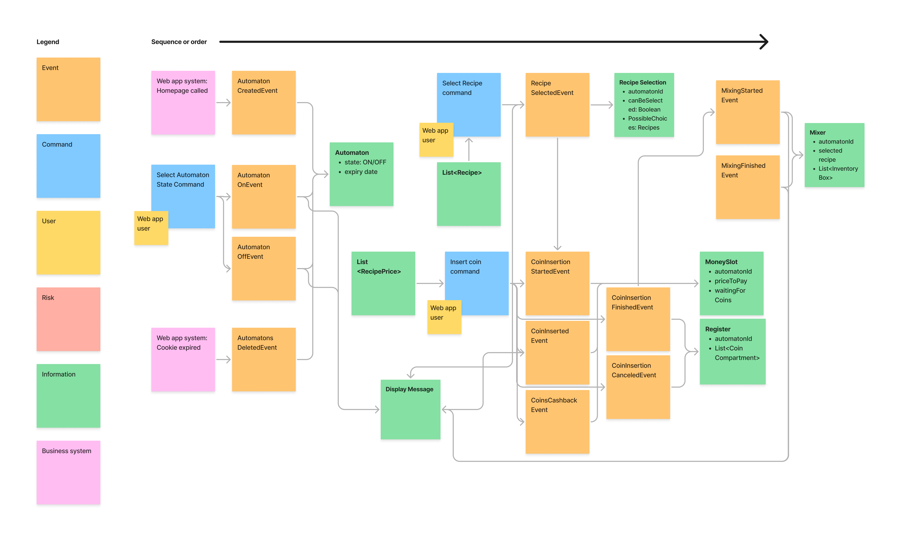

# Domain-Driven Design (DDD) - Soda machine

## Design goals

In this project I utilize the method of Domain-Driven Design (DDD) to model a coffee / soda machine. The goal of this project is to show how we can use the out-of-the-box tools of Spring to make a proper domain model in DDD. More to say we will show how domain objects called aggregates in DDD are modeled correctly in a relational database. The aggregates propagate their states via events and so everything is event-driven. This also means that the states propagated between aggregates are eventually consistent and, thus, take time. For that reason to propagate the event, we also use web sockets in the frontend.

However, we will not show how to create bounded contexts here in order not to confuse the interested reader of the code even more. Though, we suggest to separate the bounded contexts via a event or message queue using Spring Cloud Stream, which is quite new and helps to establish an eventing mechanism in an abstract way. It is the perfect technology and is already added to the dependencies of this project. We also don't use event sourcing though this would be a small, easy change to the code. It is due to the reader to read through the documentation of the event sourcing method.

## Event model

This event model was created using the event-storming method, which helps to properly plan the design of the application upfront in an unobtrusive way. We recommend to 

## Technology decisions

The following technologies are used:

* Spring Boot with Spring Data / Web
* Thymeleaf with Webjars
* Websockets with SockJs und Stomp
* H2 Database with Flyway, Lombok

## Links

We recommend the following links to DDD:

* [Tactical domain-driven design (software-architektur.tv)](https://software-architektur.tv/2024/05/03/folge214.html)
* [Domain-driven Design (Martin Fowler)](https://martinfowler.com/bliki/DomainDrivenDesign.html)
* [DDD starter modeling process](https://github.com/ddd-crew/ddd-starter-modelling-process)