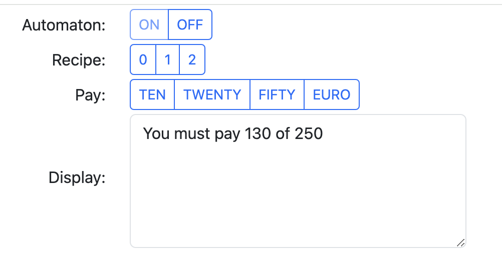
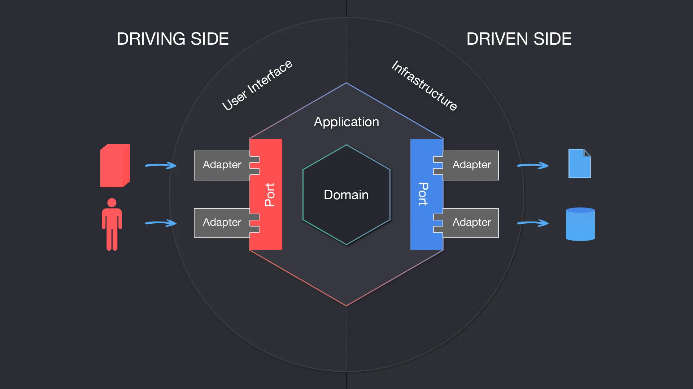

# Domain-Driven Design (DDD) - Soda machine

## Design goals

The soda machine is a web app, which utilizes the method of Domain-Driven Design (DDD) of Eric Evans. The goal of this project is to show how the out-of-the-box tools of Spring can be used to make a proper clean domain model in DDD. DDD is a modeling technique, where a domain model is the edge of the application.

### In detail

The soda machine shows how domain objects called aggregates in DDD can be modeled using a relational database. All the aggregates propagate their states via events and so the architecture is event-driven. This also means that each aggregate has a transactional context and the states propagated in between aggregates are eventually consistent and take time to propagate. To support eventing, I used Spring events in the backend and web sockets for the frontend.

### Out of scope

However, I will not show how to create bounded contexts. Though, I suggest to use an event queue using Spring Cloud Stream, which helps to establish an eventing mechanism in an abstract way. As well I don't use event sourcing, though this would be a small change to the code base. It is due to the reader to work through the documentation of event sourcing.

## User Interface

### UI functionality

The automaton has a web UI created with thymeleaf and webjars. The automaton has a display, it can be switched on and off, the recipes can be selected and payed. There's also a mixing of drinks and a cashback of coins.



## Architecture

### Hexagonal architecture

Soda machine is based on the hexagonal architecture. This architecture style uses a domain model as its core and connects these via adapters to the environment. This is a fundamental change to the multiple layer architecture, in which all the layers had concerns on their own. In hexagonal architecture style all the interfaces and UIs are organized and isolated via adapters, which can be connected to ports in the domain model.



### Domain model

The application is organized by the following aggregates:

* **Automaton**: On each start an automaton is created, which can be switched on and off
* **Recipe**: Holds the recipes with its ingredients, e.g. black coffee, white coffee, milk and soda
* **Price**: Hold the prices of each of the recipes in Cent, which is dependant on a separate priceId
* **Selection**: Holds the selected recipes of each automaton and if selecting recipes is possible
* **Pay**: Holds the inserted coins in a money slot and the register of the automaton
* **Mixing**: Holds the Mixer state and the inventory boxes with their fills (like a coffee, milk or soda box)
* **Display**: Holds the output messages of each automaton, which is displayed to the UI
* **Trace**: Traces all the events in the application and prints it to the console

E.g. a `Mixer` aggregate looks like this. It extends the `AbstractAggregateRoot` interface, is annotated by `@Entity` and has an id annotated by `@Id`. It contains domain methods like `mixRecipe(RecipeComposite)` and registers events via `registerEvent(MixingStartedEvent)`, which are fired on saving it.

```java
@Entity
@Data
@EqualsAndHashCode(callSuper = true)
public class Mixer extends AbstractAggregateRoot<Mixer> {

    @Id
    private Long automatonId;

    @OneToMany(fetch = FetchType.EAGER, cascade = {CascadeType.ALL})
    private Set<InventoryBox> inventoryBoxes;

    private RecipeId selectedRecipe;

    public List<Future<Boolean>> mixRecipe(RecipeComposite recipe) {
        // mixes each ingredient of the recipe
    }
}
```

### Event model

The event flow was created using the event-storming method of Alberto Brandolini, which helps to properly design the application events upfront in an unobtrusive way by using events as the first-class citizen.


## Technology decisions

The following technologies are used:

* Spring Boot with Spring Data / Web
* Thymeleaf with Webjars
* Websockets with SockJs und Stomp
* H2 Database with Flyway, Lombok
* At least Java with JDK 21

## Links

I recommend the following links to DDD:

* [Tactical domain-driven design (software-architektur.tv)](https://software-architektur.tv/2024/05/03/folge214.html)
* [Domain-driven Design (Martin Fowler)](https://martinfowler.com/bliki/DomainDrivenDesign.html)
* [DDD starter modeling process](https://github.com/ddd-crew/ddd-starter-modelling-process)
